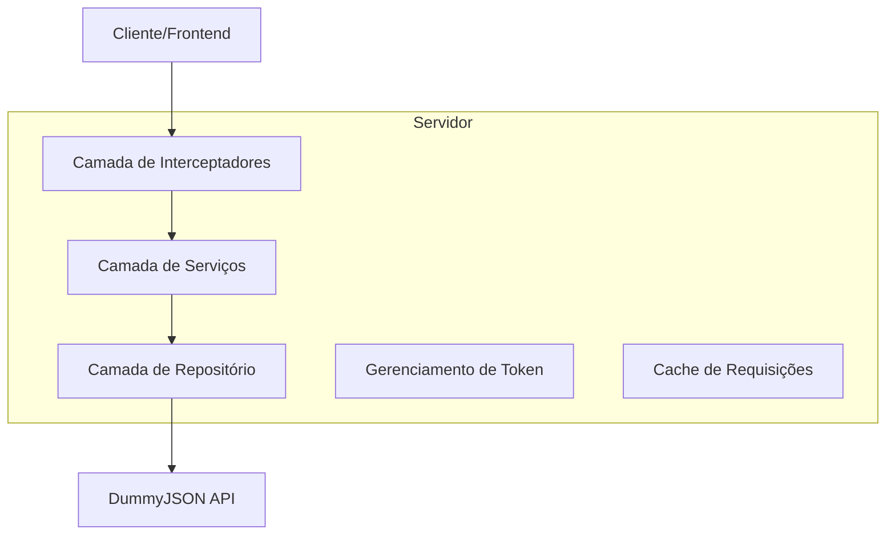
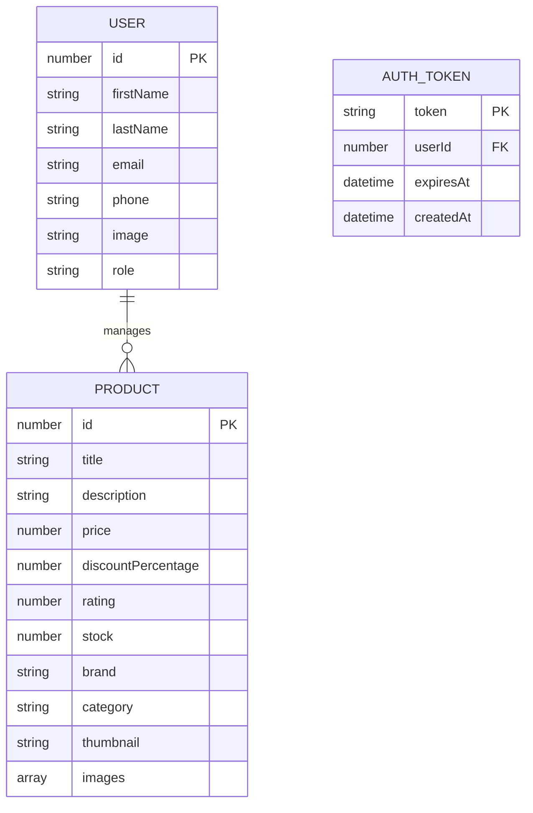

# Arquitetura Técnica - Integração DummyJSON

## 1. Design da Arquitetura

```mermaid
graph TD
  A[Navegador do Usuário] --> B[Aplicação React/Next.js]
  B --> C[Serviços de API]
  C --> D[DummyJSON API]
  C --> E[Interceptadores HTTP]
  
  subgraph "Camada Frontend"
    B
    F[Contextos React]
    G[Hooks Customizados]
    H[Componentes UI]
  end
  
  subgraph "Camada de Serviços"
    C
    E
    I[Gerenciamento de Token]
    J[Cache Local]
  end
  
  subgraph "APIs Externas"
    D
  end
end
```

## 2. Descrição das Tecnologias

- **Frontend**: React@18 + Next.js@14 + TypeScript + Tailwind CSS
- **Gerenciamento de Estado**: Context API + Hooks customizados
- **HTTP Client**: Fetch API nativo com interceptadores customizados
- **API Externa**: DummyJSON (https://dummyjson.com)
- **Autenticação**: JWT tokens com armazenamento seguro

## 3. Definições de Rotas

| Rota | Propósito |
|------|----------|
| /login | Página de autenticação, permite login via DummyJSON |
| /dashboard | Dashboard principal, exibe estatísticas e navegação |
| /users | Gerenciamento de usuários, operações CRUD completas |
| /products | Gerenciamento de produtos, listagem e operações CRUD |
| /profile | Perfil do usuário, edição de dados pessoais |

## 4. Definições de API

### 4.1 APIs Principais

**Autenticação de usuário**
```
POST https://dummyjson.com/auth/login
```

Request:
| Nome do Parâmetro | Tipo do Parâmetro | Obrigatório | Descrição |
|-------------------|-------------------|-------------|----------|
| username | string | true | Nome de usuário para login |
| password | string | true | Senha do usuário |

Response:
| Nome do Parâmetro | Tipo do Parâmetro | Descrição |
|-------------------|-------------------|----------|
| token | string | Token JWT para autenticação |
| user | object | Dados do usuário autenticado |

Exemplo:
```json
{
  "username": "kminchelle",
  "password": "0lelplR"
}
```

**Buscar usuários**
```
GET https://dummyjson.com/users
```

Request:
| Nome do Parâmetro | Tipo do Parâmetro | Obrigatório | Descrição |
|-------------------|-------------------|-------------|----------|
| limit | number | false | Número máximo de usuários por página |
| skip | number | false | Número de usuários para pular (paginação) |
| select | string | false | Campos específicos para retornar |

Response:
| Nome do Parâmetro | Tipo do Parâmetro | Descrição |
|-------------------|-------------------|----------|
| users | array | Lista de usuários |
| total | number | Total de usuários disponíveis |
| skip | number | Número de usuários pulados |
| limit | number | Limite por página |

**Buscar produtos**
```
GET https://dummyjson.com/products
```

Request:
| Nome do Parâmetro | Tipo do Parâmetro | Obrigatório | Descrição |
|-------------------|-------------------|-------------|----------|
| limit | number | false | Número máximo de produtos por página |
| skip | number | false | Número de produtos para pular |
| category | string | false | Filtrar por categoria específica |

Response:
| Nome do Parâmetro | Tipo do Parâmetro | Descrição |
|-------------------|-------------------|----------|
| products | array | Lista de produtos |
| total | number | Total de produtos disponíveis |
| skip | number | Número de produtos pulados |
| limit | number | Limite por página |

**Criar usuário**
```
POST https://dummyjson.com/users/add
```

Request:
| Nome do Parâmetro | Tipo do Parâmetro | Obrigatório | Descrição |
|-------------------|-------------------|-------------|----------|
| firstName | string | true | Primeiro nome do usuário |
| lastName | string | true | Sobrenome do usuário |
| email | string | true | Email do usuário |
| phone | string | false | Telefone do usuário |

**Atualizar usuário**
```
PUT https://dummyjson.com/users/{id}
```

**Excluir usuário**
```
DELETE https://dummyjson.com/users/{id}
```

**Criar produto**
```
POST https://dummyjson.com/products/add
```

**Atualizar produto**
```
PUT https://dummyjson.com/products/{id}
```

**Excluir produto**
```
DELETE https://dummyjson.com/products/{id}
```

## 5. Arquitetura do Servidor



## 6. Modelo de Dados

### 6.1 Definição do Modelo de Dados



### 6.2 Definições de Tipos TypeScript

**Tipos de Usuário DummyJSON**
```typescript
// Tipo de usuário baseado na API DummyJSON
interface DummyJSONUser {
  id: number;
  firstName: string;
  lastName: string;
  maidenName: string;
  age: number;
  gender: string;
  email: string;
  phone: string;
  username: string;
  password: string;
  birthDate: string;
  image: string;
  bloodGroup: string;
  height: number;
  weight: number;
  eyeColor: string;
  hair: {
    color: string;
    type: string;
  };
  domain: string;
  ip: string;
  address: {
    address: string;
    city: string;
    coordinates: {
      lat: number;
      lng: number;
    };
    postalCode: string;
    state: string;
  };
  macAddress: string;
  university: string;
  bank: {
    cardExpire: string;
    cardNumber: string;
    cardType: string;
    currency: string;
    iban: string;
  };
  company: {
    address: {
      address: string;
      city: string;
      coordinates: {
        lat: number;
        lng: number;
      };
      postalCode: string;
      state: string;
    };
    department: string;
    name: string;
    title: string;
  };
  ein: string;
  ssn: string;
  userAgent: string;
}

// Tipo de produto baseado na API DummyJSON
interface DummyJSONProduct {
  id: number;
  title: string;
  description: string;
  price: number;
  discountPercentage: number;
  rating: number;
  stock: number;
  brand: string;
  category: string;
  thumbnail: string;
  images: string[];
}

// Tipo de resposta de autenticação
interface AuthResponse {
  id: number;
  username: string;
  email: string;
  firstName: string;
  lastName: string;
  gender: string;
  image: string;
  token: string;
}

// Tipo de resposta paginada
interface PaginatedResponse<T> {
  [key: string]: T[] | number;
  total: number;
  skip: number;
  limit: number;
}

// Configuração de interceptadores HTTP
interface HTTPConfig {
  baseURL: string;
  timeout: number;
  headers: Record<string, string>;
}
```

**Serviços de API**
```typescript
// Configuração base da API
const API_CONFIG = {
  baseURL: 'https://dummyjson.com',
  timeout: 10000,
  headers: {
    'Content-Type': 'application/json'
  }
};

// Interceptador para adicionar token de autenticação
const authInterceptor = (config: RequestInit): RequestInit => {
  const token = localStorage.getItem('auth-token');
  if (token) {
    config.headers = {
      ...config.headers,
      'Authorization': `Bearer ${token}`
    };
  }
  return config;
};

// Interceptador para tratamento de erros
const errorInterceptor = (response: Response): Response => {
  if (!response.ok) {
    if (response.status === 401) {
      // Token expirado, redirecionar para login
      localStorage.removeItem('auth-token');
      window.location.href = '/login';
    }
    throw new Error(`HTTP Error: ${response.status}`);
  }
  return response;
};
```