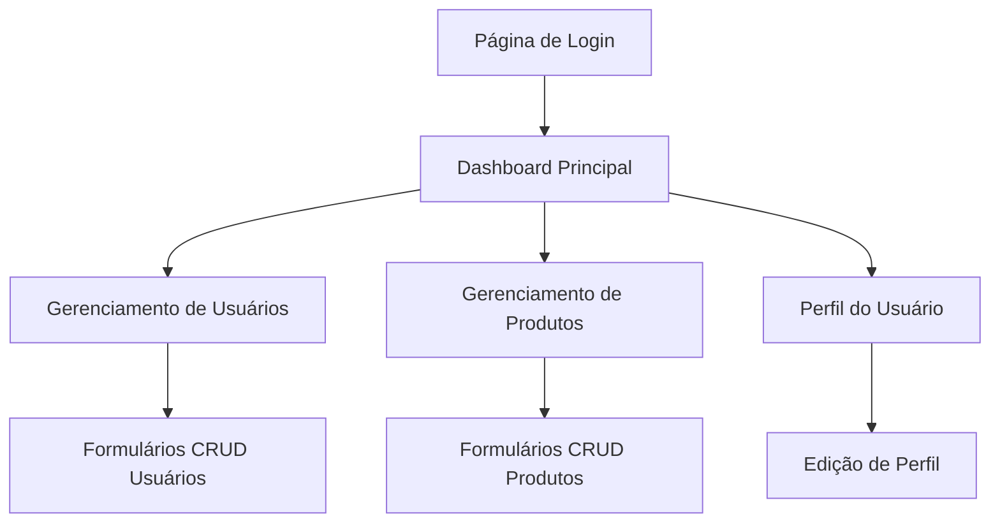

# Integração DummyJSON - Requisitos do Produto

## 1. Visão Geral do Produto

Sistema de dashboard administrativo com autenticação real e gerenciamento completo de usuários e produtos utilizando a API DummyJSON. O projeto substituirá todos os dados mockados por integração real com serviços externos, oferecendo funcionalidades CRUD completas e autenticação JWT.

- Soluciona a necessidade de um sistema de gerenciamento real com dados dinâmicos
- Destinado a administradores e usuários que precisam gerenciar produtos e usuários
- Oferece interface moderna com Next.js e operações em tempo real

## 2. Funcionalidades Principais

### 2.1 Papéis de Usuário

| Papel | Método de Registro | Permissões Principais |
|-------|-------------------|----------------------|
| Usuário Autenticado | Login via DummyJSON API | Pode visualizar e gerenciar dados conforme permissões |
| Administrador | Credenciais específicas | Acesso completo a todas as funcionalidades CRUD |

### 2.2 Módulos de Funcionalidade

Nosso sistema consiste nas seguintes páginas principais:
1. **Página de Login**: formulário de autenticação, validação de credenciais, gerenciamento de sessão
2. **Dashboard Principal**: estatísticas em tempo real, gráficos de dados, navegação principal
3. **Gerenciamento de Usuários**: listagem paginada, criação, edição, exclusão de usuários
4. **Gerenciamento de Produtos**: listagem com filtros, operações CRUD completas, categorização
5. **Perfil do Usuário**: visualização e edição de dados pessoais, configurações de conta

### 2.3 Detalhes das Páginas

| Nome da Página | Nome do Módulo | Descrição da Funcionalidade |
|----------------|----------------|-----------------------------|
| Página de Login | Formulário de Autenticação | Validar credenciais via DummyJSON, gerenciar tokens JWT, redirecionamento pós-login |
| Página de Login | Gerenciamento de Sessão | Armazenar tokens seguros, verificar expiração, logout automático |
| Dashboard Principal | Estatísticas em Tempo Real | Buscar e exibir métricas atualizadas de usuários e produtos |
| Dashboard Principal | Gráficos de Dados | Renderizar gráficos interativos com dados da API |
| Gerenciamento de Usuários | Listagem Paginada | Implementar paginação, filtros de busca, ordenação |
| Gerenciamento de Usuários | Operações CRUD | Criar, editar, excluir usuários via API DummyJSON |
| Gerenciamento de Produtos | Listagem com Filtros | Filtrar por categoria, preço, disponibilidade |
| Gerenciamento de Produtos | Operações CRUD | Gerenciar produtos completos via API externa |
| Perfil do Usuário | Edição de Dados | Atualizar informações pessoais, upload de avatar |

## 3. Processo Principal

**Fluxo de Autenticação e Gerenciamento:**
1. Usuário acessa página de login
2. Sistema valida credenciais via DummyJSON API
3. Token JWT é armazenado de forma segura
4. Usuário é redirecionado para dashboard
5. Sistema carrega dados em tempo real da API
6. Usuário pode navegar e realizar operações CRUD
7. Sistema mantém sessão ativa com renovação automática
8. Logout limpa dados de sessão

## 4. Design da Interface do Usuário

### 4.1 Estilo de Design

- **Cores Primárias e Secundárias**: Azul (#1976d2) como primária, cinza (#f5f5f5) como secundária
- **Estilo de Botões**: Material Design com bordas arredondadas e efeitos de hover
- **Fonte e Tamanhos**: Roboto como fonte principal, tamanhos de 14px a 24px
- **Estilo de Layout**: Design baseado em cards, navegação superior fixa
- **Ícones e Emojis**: Material Icons para consistência visual

### 4.2 Visão Geral do Design das Páginas

| Nome da Página | Nome do Módulo | Elementos da UI |
|----------------|----------------|----------------|
| Página de Login | Formulário de Autenticação | Card centralizado, campos de input com validação, botão de login com loading |
| Dashboard Principal | Estatísticas | Cards com métricas, gráficos responsivos, cores de destaque para KPIs |
| Gerenciamento de Usuários | Tabela de Dados | DataGrid com paginação, botões de ação, modais para edição |
| Gerenciamento de Produtos | Lista de Produtos | Cards de produto com imagens, filtros laterais, botões de ação flutuantes |
| Perfil do Usuário | Formulário de Perfil | Layout em duas colunas, upload de imagem, campos editáveis |

### 4.3 Responsividade

O produto é desktop-first com adaptação completa para mobile, incluindo otimização para interação touch e navegação por gestos.